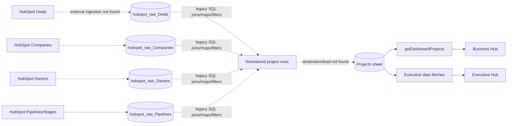
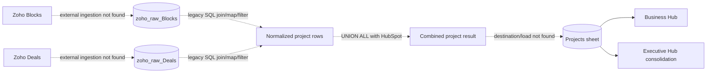
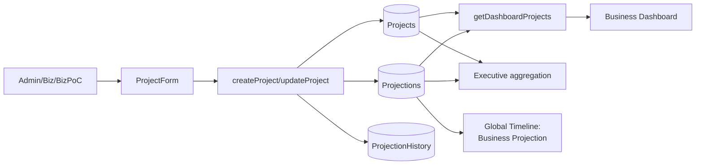
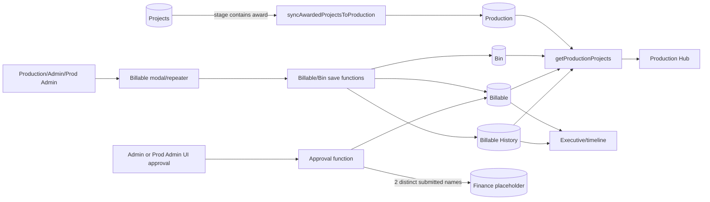
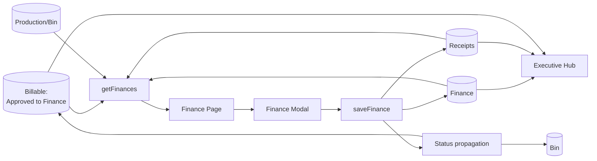
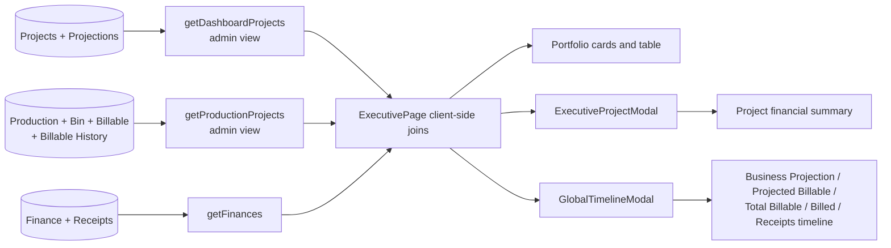
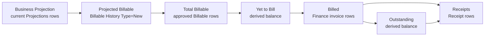

# Data flow and formula inventory

## How to read this document

Solid arrows in diagrams are confirmed active application flows. Dashed arrows represent historical evidence or an unimplemented/unconfirmed handoff. The repository proves the Apps Script/Google Sheets/React path; it does **not** prove that the legacy CRM/BigQuery query is currently scheduled or loaded into the application.

## End-to-end source flows

### HubSpot to Executive Hub



The legacy query maps HubSpot deal ID, generated Block ID, pipeline/stage labels, territory/office, owner, company, deal name, bidding/forecast data, amounts/currency, fixed USD conversion, close/created dates, and age. It filters stage/pipeline labels and joins lookup tables (`backend/old appdata bigquery.sql.txt:1-73`).

**Not found:** HubSpot API calls, line-item extraction, secrets, pagination, retry, incremental watermark, load destination, schedule, logging, or the BigQuery-to-Sheets handoff. The diagram is therefore lineage evidence, not confirmation of a live pipeline.

### Zoho to Executive Hub



The query joins Zoho Blocks to Deals, maps territory, owner, account, project/block names, stages, bidding attributes, amount/currency, fixed USD values, closing/created dates, and age. It limits rows to the Sales Pipeline and excludes an “Omitted” forecast category (`backend/old appdata bigquery.sql.txt:79-180`).

**Not found:** Zoho API calls, site-split, revenue-recognition or stage-history datasets, auth, pagination, retry, refresh mode, deduplication, or scheduling. HubSpot and Zoho results are joined with `UNION ALL`, so the historical SQL itself does not deduplicate a cross-CRM project.

### Business projection flow



Create writes Projects, Projections, and initial history. Update writes the project, upserts changed/new projections, and deletes removed projection rows (`backend/Code.gs:329-495`). Business Dashboard groups and filters the returned project/projection data client-side (`frontend/src/pages/Dashboard.jsx:181-289`).

**Mismatch:** projection changes are applied before history approval. The normal projection deletion helper removes the active row without creating a deletion-history record, even though other approval code understands a Delete type (`backend/Code.gs:389-604`).

### Production billable flow



Award matching is a case-insensitive substring search for `award`; existing Production Block IDs are not appended again (`backend/Code.gs:962-1016`). No trigger/caller is in the repository.

Initial approval accumulates distinct submitted names. At two names, the billable becomes available to Finance and a placeholder Finance row is added (`backend/Code.gs:1458-1503`). The frontend restricts approval to Admin/Prod Admin, but the backend does not independently verify that role (`frontend/src/components/BillableRepeater.jsx:525-539`).

Deleting a billable also deletes linked Finance and Receipt data in the backend save flow. This is a material destructive cascade initiated from Production (`backend/Code.gs:1320-1390`).

### Finance invoice and receipt flow



`getFinances` begins with approved billables, joins Finance records through one or more Billable IDs, joins production/bin details, and associates receipts by invoice number (`backend/Code.gs:1773-1886`). Saving an invoice/receipt updates Finance, appends receipts, and changes Billable/Bin status (`backend/Code.gs:1889-2143`).

Receipt association normally uses the raw invoice string. A normalization path requires a caller context of exactly `financeHub`, but Finance and Executive currently call without it; case or whitespace differences can therefore orphan receipts.

### Consolidated Executive Hub flow



ExecutivePage joins Business to Production by `Block_id` and Finance to billables by `Billable_id`, then derives financial metrics in the browser (`frontend/src/pages/ExecutivePage.jsx:98-339`). There is no persisted Executive summary table.

## Field ownership and lineage

“Owner” below means the system that writes the active application value, not necessarily the business-policy owner.

| Data element | Historical source evidence | Active store/field | Active writer | Read/transform/display | Status |
|---|---|---|---|---|---|
| CRM Deal ID | HubSpot Deal ID / Zoho Deal join | Projects.`Deal_id` | Unconfirmed import or project create/update | Business/Executive | CRM handoff needs confirmation |
| Project/Block ID | SQL creates `B` + deal ID for HubSpot; Zoho Block identity | Projects.`Block_id` | Import/create | Cross-module join key | Historical rule confirmed; active ownership unclear |
| Region/pipeline | HubSpot pipeline label; Zoho pipeline/filter | Projects.`Region` | Import/project | Filters, client code | Active refresh unclear |
| Contracting office/territory | CRM mapped fields | Projects.`Contracting_Office` | Import/project | Filters and client code | Active ownership unclear |
| BizPoC/email | CRM owner name/email | Projects.`BizPoC`, `email` | Import/create; update preserves original email | Data visibility and filters | Exact owner mapping needs confirmation |
| Client/project name | CRM company/deal/block | Projects client/name fields | Import/project | All hubs; masked for Production roles | Confirmed active fields |
| Stage/award | CRM stage mapping | Projects stage field | Import/project | Award sync matches text `award` | Exact approved stages need confirmation |
| Project home value/currency | CRM deal/block amount/currency | Projects home amount/currency | Import/project | Business/Executive/Production conversion | Fixed FX fallback |
| Project USD value | Legacy SQL fixed FX; UI recalculates | Projects.`Amount_in_USD` | Import or ProjectForm | KPI/filter totals | Multiple rate sets |
| Business projection | No CRM source shown | Projections amount/date | Business project form | Business and timeline | Application-owned |
| Production work/bin | No CRM source shown | Production/Bin | Production/Admin | Production/Executive | Application-owned |
| Billable amount/date | No CRM source shown | Billable | Production/Admin | Production, Finance, Executive | Application-owned |
| Billable approval | Submitted approver names | Billable approval fields | Admin/Prod Admin UI; backend trusts inputs | Finance inclusion | Identity not verified server-side |
| Invoice/tax/deductions | No external accounting integration shown | Finance | Finance/Admin | Finance/Executive | Application-owned manual entry |
| Receipt | No bank feed shown | Receipts | Finance/Admin | Finance/Executive | Application-owned manual entry |
| Client/show code | Derived + manual metadata | Clients and Production display | Client Code users/Admin | Masked Production display and CSV | Application-owned |

Field mappings are defined in `backend/Code.gs:39-144`, `backend/Code.gs:981-1005`, `backend/Code.gs:1415-1503`, `backend/Code.gs:1900-1954`, and `backend/Code.gs:2281-2359`.

## Financial lifecycle and event semantics



Yet to Bill and Outstanding are calculated balances, not separate operational records. Projected Billable is also not a dedicated current-state table: the timeline reconstructs it from initial Billable History events.

## Financial formula inventory

### Formula: Project and projection currency conversion

**Business meaning:** normalize home-currency project/projection values for USD and INR reporting.

**Implemented formula:**

```text
INR = Home Amount × fixed currency-to-INR rate
USD = INR ÷ 90
Project USD is rounded to 2 decimal places
```

Fixed frontend rates are INR 1, USD 90, EUR 107, GBP 123, AUD 63, CAD 66, and YEN 12.9.

| Input | Source | Field | Code reference |
|---|---|---|---|
| Home amount | Projects or form input | Home_Amount | `frontend/src/components/ProjectForm.jsx:129-145` |
| Currency | Projects or form input | Home_Currency | `frontend/src/components/ProjectForm.jsx:41-49` |
| Fixed FX | Frontend constant | currency map | `frontend/src/components/ProjectForm.jsx:41-49` |
| Projection amount/percentage | ProjectForm/ProjectionsRepeater | projection values | `frontend/src/components/ProjectForm.jsx:187-276`, `frontend/src/components/ProjectionsRepeater.jsx:215-256` |

**Conditions and filters:** existing ProjectForm values are recalculated from home amount/currency, potentially replacing the stored USD figure. Billable conversion prefers a stored CRM conversion rate when present, then falls back to the fixed map (`frontend/src/components/BillableRepeater.jsx:69-100`).

**Example:** EUR 100,000 → INR 10,700,000 → USD 118,888.89.

**Observations:** legacy SQL uses USD 1, INR 0.012, EUR 1.07, GBP 1.35, CAD 0.74, AUD 0.67 when calculating USD (`backend/old appdata bigquery.sql.txt:31-48`). These values are not equivalent to the frontend map. Rates have no effective date or authoritative service.

### Formula: Business Projection

**Business meaning:** the dated amount Business expects to become available.

**Implemented formula:** each active projection contributes its `Amount_in_USD` to the date bucket containing `Revenue_date`. Dashboard totals sum eligible projections; project percentage is:

```text
Projection % = Projection USD ÷ Project Total USD × 100
Projection USD = Project Total USD × Projection % ÷ 100
```

| Input | Source | Field | Code reference |
|---|---|---|---|
| Projection amount | Projections | Amount_in_USD / Amount_in_Inr | `backend/Code.gs:124-144` |
| Projection date | Projections | Revenue_date | `backend/Code.gs:124-144` |
| Project total | Projects/form | Amount_in_USD | `frontend/src/components/ProjectionsRepeater.jsx:215-256` |

**Conditions and filters:** Dashboard excludes history-like Delete entries if present, applies timeline/FY/month filters to projection dates, and applies project search/stage/office/owner/region/territory filters (`frontend/src/pages/Dashboard.jsx:181-289`). Duplicate project rows are grouped and their projection arrays concatenated (`frontend/src/pages/Dashboard.jsx:220-244`).

**Example:** USD 500,000 project × 20% = USD 100,000 projection.

**Observations:** projection date and amount changes are effective before approval. The current Projections sheet is the operational truth; ProjectionHistory is audit metadata.

### Formula: Projected Billable

**Business meaning:** what Production expects to become billable, by date.

**Implemented formula:** for the Global Timeline, sum Billable History events where `Type === 'New'`, using the event's billable date and home amount converted to the selected currency (`frontend/src/components/GlobalTimelineModal.jsx:103-116`).

| Input | Source | Field | Code reference |
|---|---|---|---|
| Initial billable event | Billable History | Type = New | `backend/Code.gs:1570-1573` |
| Expected date | Billable History | Billable date | `frontend/src/components/GlobalTimelineModal.jsx:103-116` |
| Expected amount/currency | Billable History | home amount/currency | `frontend/src/components/GlobalTimelineModal.jsx:40-57` |

**Conditions and filters:** only `New` history events contribute. Later current-state edits are not represented as a separate forecast curve unless their initial event data is itself updated, which is not the normal history model.

**Example:** two New events of USD 30,000 and USD 20,000 in May produce a May Projected Billable of USD 50,000.

**Observations:** this is a history-derived proxy. There is no separate “Projected Billable” table or explicit forecast/actual status. The name and intended current-state policy **Need Business Confirmation**.

### Formula: Total Billable

**Business meaning:** completed Production work approved for Finance.

**Implemented formulas differ by view:**

| View | Implemented inclusion rule | Reference |
|---|---|---|
| Global Timeline | `Approved_to_Finance == true` and not held | `frontend/src/components/GlobalTimelineModal.jsx:121-135` |
| Executive summary | Approved to Finance; hold not excluded | `frontend/src/pages/ExecutivePage.jsx:98-339` |
| Finance | Starts from approved billables; rows without invoice are labeled Total Billables | `backend/Code.gs:1773-1886`, `frontend/src/pages/FinancePage.jsx:482-615` |
| Production totals | All dated billables, regardless of approval or hold | `frontend/src/pages/ProductionPage.jsx:213-260` |

**Formula:** `Total Billable = Σ eligible Billable amount`, with eligibility varying above.

**Example:** approved non-held 80,000 + approved held 20,000 + unapproved 10,000 produces Timeline 80,000, Executive 100,000, and Production 110,000.

**Observations:** this is the largest terminology inconsistency. Product/Finance must choose whether held approved work is completed, available to Finance, or excluded, and the UI should use distinct labels where Production intentionally reports a broader number.

### Formula: Yet to Bill

**Business meaning:** approved billable value not yet invoiced.

**Expected formula:** `Yet to Bill = Total Billable - Billed`.

**Implemented formula:**

```text
Yet to Bill = max(0, Approved Production Amount - Billed Amount)
```

| Input | Source | Field | Code reference |
|---|---|---|---|
| Approved production amount | Billable | amount fields; Approved_to_Finance | `frontend/src/pages/ExecutivePage.jsx:98-339` |
| Billed amount | Finance | billed home/INR amount | `frontend/src/components/FinanceModal.jsx:470-578` |

**Conditions and filters:** Executive excludes Finance rows categorized as Credit Note from billed totals. Hold is not excluded from Executive's approved amount. FinancePage also labels approved, invoice-less rows as “Total Billables,” which operationally represents items yet to be invoiced.

**Example:** approved 100,000 and billed 70,000 → 30,000. Approved 100,000 and billed 110,000 → 0, hiding a 10,000 over-billed variance.

**Implementation references:**

- `frontend/src/pages/ExecutivePage.jsx:316-317`
- `frontend/src/components/FinanceModal.jsx:565-566`
- `frontend/src/components/ExecutiveProjectModal.jsx:66-269`

**Observations:** clamping avoids a negative card value but suppresses overbilling. Hold differences also change the starting amount.

### Formula: Billed

**Business meaning:** amount for which Finance has recorded an invoice.

**Implemented formula:** sum Finance items with a nonblank `Invoice_Number`, using billed INR where available or a billable-derived fallback. KPI/timeline implementations normally exclude `Billing_type === 'Credit Note'` (`frontend/src/pages/FinancePage.jsx:482-615`, `frontend/src/pages/ExecutivePage.jsx:98-339`).

| Input | Source | Field | Code reference |
|---|---|---|---|
| Invoice presence | Finance | Invoice_Number | `backend/Code.gs:1900-1906` |
| Home billed value | Finance | Billed_Home Amount | `frontend/src/components/FinanceModal.jsx:196-207` |
| INR billed value | Finance | Billed_Amount_in_Inr | `frontend/src/pages/FinancePage.jsx:482-615` |

**Example:** invoices of INR 900,000 and INR 450,000 produce INR 1,350,000 billed.

**Observations:** shared/merged invoice rows are grouped or deduplicated differently across views. Status propagation marks a billable billed when an invoice number exists without the KPI's Credit Note exclusion (`backend/Code.gs:2084-2143`). A credit note can therefore affect status but not billed KPIs.

### Formula: Receipts

**Business meaning:** client money recorded as received.

**Implemented formula:** sum receipt INR amounts, or convert receipt home amounts using the entered receipt exchange rate. The modal rounds computed INR to a whole unit (`frontend/src/components/FinanceModal.jsx:946-987`).

| Input | Source | Field | Code reference |
|---|---|---|---|
| Receipt identity | Receipts | Receipt_id | `backend/Code.gs:1938-1954` |
| Invoice association | Receipts | Invoice_Number | `backend/Code.gs:1938-1954` |
| Amount/date/rate | Receipts | receipt amount fields, Receipt_date, exchange rate | `backend/Code.gs:2059-2067` |

**Conditions and filters:** FinancePage deduplicates by Receipt ID or a composite invoice/date/amount key (`frontend/src/pages/FinancePage.jsx:553-609`). Global Timeline includes a receipt only when it has a nonblank unique Receipt ID; a receipt without one is omitted (`frontend/src/components/GlobalTimelineModal.jsx:145-155`).

**Example:** EUR 1,000 at receipt exchange rate 107 → INR 107,000.

**Observations:** raw invoice-number joins are case/space-sensitive in the normal backend read. Schema drift can drop some receipt fields if the sheet lacks matching headers.

### Formula: Outstanding

**Business meaning:** invoiced value not yet collected.

**Expected simplified formula:** `Outstanding = Billed - Receipts - Other Charges` (strictly excluding GST).

**Implemented formulas are not canonical and sometimes incorrectly include GST:**

| Implementation | India | Non-India | Reference |
|---|---|---|---|
| FinanceModal save | Billed INR − Receipts INR − TDS | Billed INR − Receipts INR − TDS − Exchange Difference − Bank Charges | `frontend/src/components/FinanceModal.jsx:341-379` |
| FinancePage filter fallback | Total with GST − GST Received − TDS − Exchange Difference − Bank Charges − Receipts | Billed − Receipts − Exchange Difference − Bank Charges | `frontend/src/pages/FinancePage.jsx:275-305` |
| Executive summary | Billed − Receipts − TDS; for non-INR also handles bank/exchange charges in INR paths | Billed − Receipts − TDS − Bank Charges − Exchange Difference | `frontend/src/pages/ExecutivePage.jsx:98-339` |
| Maintenance function | Base (Total+GST when positive, else billed) − GST Received − Receipts − TDS − Exchange Difference − Bank Charges | Same generic structure | `backend/Code.gs:827-960` |

**Inputs:**

| Input | Source | Field | Code reference |
|---|---|---|---|
| Billed/total+GST | Finance | Billed INR, total+GST (Note: Including GST violates the strict business rule) | `backend/Code.gs:1900-1906` |
| Receipts | Receipts | Receipt Amount INR | `backend/Code.gs:2059-2067` |
| Tax/deductions | Finance | GST received, TDS, bank charges, exchange difference | `backend/Code.gs:1900-1906` |

**Example:** billed 100,000, receipts 60,000, TDS 10,000, bank 1,000, exchange difference 500:

- simplified expected outstanding = 40,000
- FinanceModal India = 30,000
- FinanceModal non-India = 28,500

**Observations:** GST is included in some base amounts and omitted in others. Home-currency project/modal summaries also differ in which INR charges are converted back to home currency. The maintenance function is not called in the repository, so stored Outstanding may reflect manual saves rather than that batch formula. Finance must define one control formula and sign convention for exchange differences.

### Formula: Invoice due date

**Business meaning:** expected payment deadline.

**Implemented formula:** `Due Date = Billed Date + 30 calendar days` (`frontend/src/components/FinanceModal.jsx:179-194`).

**Example:** billed 1 May → due 31 May.

**Conditions/risks:** no weekend/holiday adjustment or client credit term is present. JavaScript parsing of ISO date-only strings can be timezone-sensitive.

### Formula: GST, TDS, and payment status

**Implemented formulas:**

```text
Billed INR = Billed Home Amount × Invoice Exchange Rate
GST Amount = round(Billed INR × GST Percentage ÷ 100)
Total with GST = Billed INR + GST Amount
TDS Value = Billed INR × TDS Percentage ÷ 100
TDS Percentage = TDS Value ÷ Billed INR × 100
Paid = calculated outstanding <= 100 and at least one receipt amount > 0
```

References: `frontend/src/components/FinanceModal.jsx:196-231`, `frontend/src/components/FinanceModal.jsx:255-282`.

**Example:** billed home 1,000 × rate 90 = INR 90,000; GST 18% = 16,200; total = 106,200. TDS 10% = 9,000.

**Observations:** Payment Status can be manually overridden. The threshold allows a residual of up to INR 100 to count as Paid, but only if a receipt exists. Because outstanding variants differ, status can differ depending on which path last saved/recomputed it.

### Formula: Production and billing status

**Implemented rule:**

- Finance row with an Invoice Number sets the linked Billable status to Billed.
- If all billables in a bin are Billed, Bin status is Billed.
- If some are Billed, Bin status is Partially Billed.
- Otherwise Bin status is Billable.
- Unmerge clears invoice values and rolls linked status back (`backend/Code.gs:2084-2269`).

**Approval rule:** one unique approver name → Partially Approved; two or more → Approved to Finance (`backend/Code.gs:1458-1503`).

**Risk:** credit-note invoice numbers participate in status even when credit notes are excluded from KPI billed totals. Approver identity/role is not validated server-side.

### Formula: Financial year, calendar year, month, and week

**Implemented rules:**

- Financial year is April–March; January–March belong to the FY that started in the previous calendar year.
- Calendar year is January–December.
- Quarter helpers include both calendar and financial quarter mapping.
- Dashboard week filters are Monday-based.
- Global Timeline weekly buckets are week-of-month: `ceil(day of month ÷ 7)`.
- Global Timeline monthly buckets with multiple selected years aggregate equal month names across those years.

References: `frontend/src/lib/utils.js:58-86`, `frontend/src/components/GlobalTimelineModal.jsx:165-247`.

**Example:** 15 February 2026 belongs to FY 2025–26 and Global Timeline February week 3.

**Business Rule (ETL):** Dates must be stored as strings prefixed with an apostrophe (') in Google Sheets to prevent auto-formatting and maintain data integrity.

**Observation:** “weekly” comparisons are not consistent between dashboard and Global Timeline. Aggregating January 2025 and January 2026 into one “Jan” bucket may be unexpected when multiple years are selected.

### Formula: Percentage and allocation rules

| Rule | Implemented formula | Rounding/condition | Reference |
|---|---|---|---|
| Projection share | projection USD ÷ project USD × 100 | UI percentage calculation | `frontend/src/components/ProjectionsRepeater.jsx:215-256` |
| Projection from share | project USD × percentage ÷ 100 | Converted on edit/submit | same |
| Bin share of project | bin amount ÷ project home amount × 100 | Two-decimal display | `frontend/src/components/BillableRepeater.jsx:250-269` |
| Billable share of bin | billable amount ÷ bin amount × 100 | Two-decimal display | `frontend/src/components/BillableRepeater.jsx:417-449` |
| Merged invoice split | billable home amount ÷ total merged billable home × invoice amount | Two-decimal splits | `frontend/src/components/FinanceModal.jsx:384-458` |

Merged invoice receipts are not proportionally split in the modal payload. The backend uses a processed-invoice set so it appends one receipt for the raw invoice string during a save (`backend/Code.gs:1889-2082`).

### Formula: Client code generation

The generator derives three letters from the cleaned client name, then adds one region character, one territory character, and a miscellaneous suffix. Region uses Domestic→D and International→I; territory includes Others→W, UK→K, USA→U. It tries 50 random candidates and then falls back to a numeric suffix. An existing matching client/misc combination can reuse a code (`backend/Code.gs:2405-2456`).

**Risk:** this is random candidate generation, not a deterministic business identifier. Save does not itself invoke the separate validation function, and frontend validation can fail open after a request error.

## Filters, inclusion rules, and null/duplicate handling

### Business Dashboard

- Groups duplicate Project IDs, sums their project values, and concatenates projections.
- Search plus stage, office, BizPoC, region, territory, timeline, FY, month, and close/projection-date contexts affect results.
- Project total in close-date context sums project USD; projection context sums eligible projection values.
- Display INR is generally USD × 90.
- A debounced search variable exists, but filtering uses the raw search value, so the debounce does not govern filtering (`frontend/src/pages/Dashboard.jsx:220-289`, `frontend/src/pages/Dashboard.jsx:375-458`).

### Production

- Supports project/status/office/region, awaiting approval, recent unapproved changes, past billable dates, timeline/FY/month and search filters.
- Production quarterly/monthly billable totals include all current billables with dates, not only approved/non-held entries.
- Non-admin Production users have Client and project name masked to show/client codes according to backend role arguments (`backend/Code.gs:1242-1263`).

### Finance

- Starts from approved billables.
- Filters invoice status, payment status, past due, office/region, search, date context, period/FY/month.
- Aggregated table rows group by raw Invoice Number and combine Billable IDs.
- Receipt-context KPIs deduplicate by Receipt ID or composite fallback.
- Past-due fallback uses a simpler receipt-versus-billed tolerance than the general outstanding formula (`frontend/src/pages/FinancePage.jsx:266-480`).

### Executive

- Joins by Block ID and Billable ID in memory.
- Close-date FY/CY, office, stage, outstanding, and search filters change visible projects and totals.
- Credit Notes are normally excluded from billed totals.
- Receipt identity and merged/shared invoice handling are normalized differently between aggregate, project modal, and Global Timeline.

## Global Timeline deep dive

The component receives project, production, and finance arrays through props. It does not call a dedicated reporting endpoint.

1. Projection arrays from all projects are flattened.
2. Dates are parsed through shared/fallback date handling.
3. Each event is assigned one of five metrics:
   - Business Projection: current projection amount/date
   - Projected Billable: Billable History Type New
   - Total Billable: current approved, non-held billables
   - Billed: non-Credit Note finance records by billed date
   - Receipts: unique nonblank Receipt IDs by receipt date
4. Home values are converted through a fixed INR bridge for the selected display currency.
5. Events are filtered to selected financial years.
6. They are grouped by calendar month or week-of-month.
7. Metric toggles control which series are drawn.

References: `frontend/src/components/GlobalTimelineModal.jsx:29-248`, `frontend/src/components/GlobalTimelineModal.jsx:460-496`.

Missing dates/invalid amounts do not create a usable event. Receipts without Receipt ID are omitted. Billed events do not use the same robust invoice grouping as ExecutiveProjectModal, so merged/shared invoice rows can be counted more than once. The project modal has a comment describing billable selection by status, but the implemented projected-billable curve uses New history events; the implementation is authoritative.

## Workflow control points

| Workflow | Trigger | Checks | Write/side effect | Unclear or risky behavior |
|---|---|---|---|---|
| Project create | Admin UI | Route role; selected fields | Projects, Projections, history | Backend does not reauthorize |
| Project update | Biz/BizPoC/Admin UI | Route role; UI field controls | Project + immediate projection upsert/delete | Approval is retrospective |
| Award sync | Unknown/manual/external | Stage contains `award`; Block ID absent in Production | Append Production row | Trigger and exact award stages unknown |
| Billable save | Production/Admin UI | UI bin/date/amount validation | Billable, Bin, history; deletions cascade to Finance/Receipts | Non-transactional |
| Initial billable approval | Admin/Prod Admin UI | Client present; distinct submitted name | Approval fields; after two names Finance placeholder | Identity/role not checked server-side |
| Billable change approval | Admin/Prod Admin UI | Unapproved history row | Marks history approved | Underlying change already active |
| Finance save | Finance/Admin UI | invoice/receipt exchange rate validation | Finance, Receipts, Billable/Bin status | Multiple outstanding definitions |
| Client code save | Client Code/Admin UI | Debounced duplicate check | Clients | Backend save does not enforce validator |

## Confirmed gaps requiring business or operational input

1. Which CRM is authoritative for each project field, and is the legacy SQL still used?
2. How does a transformed CRM row reach the Projects sheet, at what frequency, and with what conflict policy?
3. Are HubSpot line items and Zoho site splits/revenue recognition/stage history intentionally out of scope?
4. Which exact deal stages qualify as awarded?
5. Who owns and invokes awarded sync and finance maintenance?
6. Should approval prevent a projection/billable change from becoming active?
7. Should held approved billables appear in Executive totals or Finance?
8. Which FX source/date and rounding method are authoritative?
9. What is the canonical Outstanding formula for India and non-India, including GST/GST receipt, TDS, bank charges, exchange difference, and credit notes?
10. Should negative Yet to Bill expose overbilling rather than clamp to zero?
11. What are invoice-number normalization and receipt identity rules?
12. Are “week” and multi-year month aggregation intended to differ between dashboards and Global Timeline?
