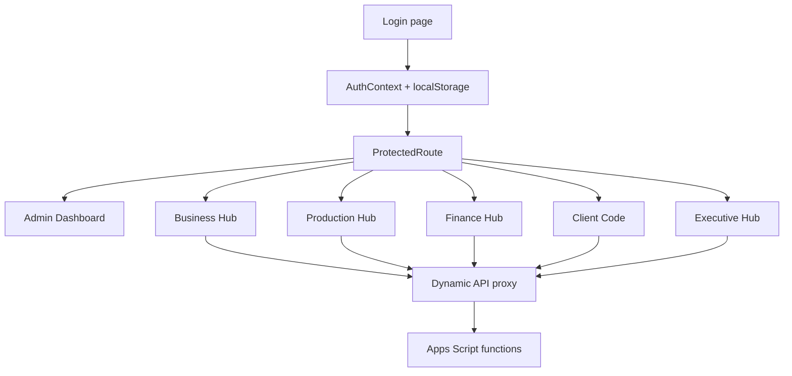

# System architecture

## Architecture summary

The application is a React single-page application packaged for a Google Apps Script web app. React calls server-side Apps Script functions through `google.script.run`; those functions read and write tabs in the active Google Spreadsheet. The Executive view consolidates data in the browser rather than through a separate reporting service.

```mermaid
flowchart LR
    U[Browser user] --> SPA[React SPA]
    SPA -->|google.script.run| GAS[Google Apps Script<br/>backend/Code.gs]
    GAS --> SS[(Active Google Spreadsheet)]
    SS --> P[Projects / Projections]
    SS --> PR[Production / Billable / Bin]
    SS --> F[Finance / Receipts]
    SS --> A[Users / Clients / Histories]

    CRM[HubSpot and Zoho] -->|Python Scripts via GitHub Actions| BQ[(BigQuery raw tables)]
    BQ -->|vw_dealsxblocks SQL views| BQV[(BigQuery Views)]
    BQV -->|GConnectors| ESS[(Extracted Google Sheet)]
    ESS -->|Apps Script Trigger (Twice a day)| SS
```

The CRM path is fully automated. Python scripts extract data from HubSpot and Zoho APIs and load it into Google BigQuery. SQL views normalize this data. `GConnectors` pull the view data into an intermediary Google Sheet. Finally, an Apps Script trigger runs twice a day to push this data into the active application's spreadsheet tabs (Projects, Projections, ProjectionHistory, Production).

## Technology stack

| Layer | Technology | Evidence |
|---|---|---|
| UI | React 18, React Router 6, Recharts, Lucide React, Tailwind CSS | `frontend/package.json:6-38` |
| Build | Vite 5 and PostCSS/Tailwind; custom asset inliner | `frontend/package.json:6-38`, `frontend/inline-assets.js` |
| Backend | Google Apps Script JavaScript | `backend/Code.gs:1-2594` |
| Persistence | Tabs in the active Google Spreadsheet | `backend/Code.gs:688-757`, `backend/Code.gs:2516-2594` |
| Browser/backend bridge | `google.script.run` dynamic proxy | `frontend/src/lib/api.js:1-126` |
| Local fallback | In-browser mock data and no-op/nullable calls | `frontend/src/lib/api.js:42-126` |
| Optional static hosting config | Vercel SPA rewrite | `frontend/vercel.json:1-8` |

No Node/Express server, REST controller layer, database driver, Apps Script manifest, Docker definition, checked-in environment file, or automated test suite was found.

## Repository and source of truth

| Path | Purpose | Source-of-truth assessment |
|---|---|---|
| `frontend/src` | React routes, pages, components, context, API adapter, utilities | **Inferred current editable frontend source** |
| `backend/Code.gs` | Apps Script business and persistence logic | **Inferred current editable backend source** |
| `backend/index.html` | Built/inlined React output for Apps Script | Generated deployment artifact |
| `frontend/dist`, `backend/assets` | Build output/assets | Generated |
| `build.bat`, `full_build.bat`, `backend/build.bat`, `frontend/inline-assets.js` | Build and copy/inlining workflow | Build tooling |
| root `Code.gs`, root `index.html` | Older duplicate application artifacts | **Inferred stale** |
| `Richard Backup` | Backup material | Not active |
| `backend/old appdata bigquery.sql.txt` | Historical HubSpot/Zoho normalization query | Legacy evidence, not executable application code |

The build scripts compile the frontend, inline the built assets, and place the result in `backend/index.html`. They also describe manual copying into Apps Script. This makes `frontend/src` plus `backend/Code.gs` the most plausible source pair. **Needs Business Confirmation:** which Apps Script project and spreadsheet are production, and whether Vercel is used for anything beyond experimentation.

## Frontend architecture

### Entry, routing, and state

- `frontend/src/main.jsx` mounts the React application.
- `frontend/src/App.jsx:35-165` defines HashRouter routes and role guards.
- `frontend/src/context/AuthContext.jsx:10-58` stores the returned user and login timestamp in localStorage with a 24-hour client-side expiry.
- `frontend/src/context/DataContext.jsx:22-45` loads and caches dashboard data in React state; Admin and Executive request the backend's admin view.
- `frontend/src/lib/api.js:1-126` converts arbitrary property access such as `api.getFinances()` into a `google.script.run` call. In a normal local browser, selected calls return mock data and unsupported calls resolve to null.
- `frontend/src/lib/utils.js:8-86` centralizes permissive date parsing and FY/CY helpers.



### Route and authorization matrix

| Route | Component | Allowed route roles | UI mutation behavior |
|---|---|---|---|
| `/login` | Login | Public | Calls login |
| `/admin-dashboard` | AdminDashboard | Admin, Multi Role, Executive | Module navigation |
| `/dashboard` | Dashboard | Biz, BizPoC, Admin, Executive | Executive read-only; project creation enabled only for Admin |
| `/client-code` | ClientCodePage | Client Code, Admin, Executive | Executive read-only |
| `/production` | ProductionPage | Production, Admin, Prod Admin, Executive | Executive read-only; Admin/Prod Admin approve |
| `/finance` | FinancePage | Finance, Admin, Executive | Executive read-only |
| `/executive-hub` | ExecutivePage | Executive, Admin | Read-only reporting |
| `/new-project` | NewProject | Admin | Create project |
| `/modify-project/:id` | ModifyProject | Biz, BizPoC, Admin | Modify project/projections |

References: `frontend/src/App.jsx:35-165`, `frontend/src/pages/AdminDashboard.jsx:41-170`, `frontend/src/pages/Dashboard.jsx:836-970`.

Roles can be comma-separated and are generally normalized in the React guard. Some backend checks compare exact casing, such as masking logic for `finance`, which creates avoidable behavior differences (`backend/Code.gs:1242-1263`).

### Significant UI inventory

| Component | Purpose and data | Transformations/filters | Actions and states | Reference |
|---|---|---|---|---|
| Dashboard | Business project list and projection totals from `getDashboardProjects` | Groups duplicate Project IDs, sums values, filters close/projection dates, stage, office, owner, region, territory | Search/filter, project view/edit/new; loading/error/empty views | `frontend/src/pages/Dashboard.jsx:181-289`, `frontend/src/pages/Dashboard.jsx:375-458` |
| ProjectForm | Create/update project and dated projections | Fixed-rate home→INR→USD conversion; projection percentage/amount conversion | Calls create/update backend functions; browser validation plus required project name | `frontend/src/components/ProjectForm.jsx:41-145`, `frontend/src/components/ProjectForm.jsx:187-315` |
| ProjectionsRepeater | Editable projection rows | Amount ↔ percentage of project USD | Add/edit/delete rows | `frontend/src/components/ProjectionsRepeater.jsx:215-256` |
| ProductionPage | Projects, bins, billables, history | Fixed-rate currency display; timeline, approval, status, office, region filters | Opens billable/work-order modals; loading/error/empty | `frontend/src/pages/ProductionPage.jsx:119-335`, `frontend/src/pages/ProductionPage.jsx:452-463` |
| BillableModal / BillableRepeater | Edit bins, work order and billables | Converts home→INR with stored conversion rate or fixed fallback; INR→USD at 90; calculates bin percentages | Validates bin/date/amount; save/delete; approval controls | `frontend/src/components/BillableModal.jsx:86-113`, `frontend/src/components/BillableRepeater.jsx:69-118`, `frontend/src/components/BillableRepeater.jsx:250-269` |
| FinancePage | Approved billables, invoice/receipt KPIs and table | Groups invoice rows; computes billed, receipts, due/past-due and status fallbacks | Filters and opens FinanceModal; loading/error/empty | `frontend/src/pages/FinancePage.jsx:266-615` |
| FinanceModal | Invoice, tax, deduction, receipt entry | Due date +30 days; billed INR, GST, TDS, outstanding, payment status; merge/split | Save/unmerge; validation; read-only for Executive | `frontend/src/components/FinanceModal.jsx:36-87`, `frontend/src/components/FinanceModal.jsx:128-458` |
| ExecutivePage | Client-side consolidated portfolio | Joins by Block ID/Billable ID; calculates approved, billed, receipt, yet-to-bill, outstanding | Portfolio filters; opens project/global timeline modals | `frontend/src/pages/ExecutivePage.jsx:98-339` |
| ExecutiveProjectModal | Per-project commercial/financial drill-down | Groups invoices and builds project timeline | Read-only modal, currency and period controls | `frontend/src/components/ExecutiveProjectModal.jsx:66-269` |
| GlobalTimelineModal | Cross-project event timeline | Collects projections/history/billables/finance; date/currency conversion; month or week-of-month buckets | Metric toggles, FY and currency filters; empty chart state | `frontend/src/components/GlobalTimelineModal.jsx:29-248`, `frontend/src/components/GlobalTimelineModal.jsx:460-496` |
| ClientCodePage | Client/show-code register | Duplicate checks and search/filter | Generate/save code, edit, CSV export; loading/error/empty | `frontend/src/pages/ClientCodePage.jsx:370-413`, `backend/Code.gs:2281-2464` |

`MarketingDashboard.jsx` is not routed and calls REST-like `api.get/put/post` methods that the dynamic Apps Script adapter does not implement as real HTTP calls. It appears to be an unfinished/dead artifact (`frontend/src/pages/MarketingDashboard.jsx:44-65`, `frontend/src/pages/MarketingDashboard.jsx:108-121`).

## Backend architecture

### Function-call model

Apps Script exposes global functions directly to `google.script.run`. There is no explicit endpoint allowlist or controller layer in the frontend adapter.

| Domain | Principal functions | Behavior |
|---|---|---|
| Authentication | `login`, `getUserEmailAndRole` | Reads Users Credentials; compares email/password; returns user/role |
| Business | `getDashboardProjects`, `createProject`, `updateProject` | Reads/projects projections; creates or updates rows |
| Projection history | projection upsert/delete/history approval functions | Logs selected changes; marks history approved |
| Production | `syncAwardedProjectsToProduction`, `getProductionProjects`, billable/bin save functions | Copies awarded projects, joins production tabs, applies display masking, saves work/billables |
| Billable approval | approval and history functions | Collects approver names; exposes approved billables to Finance |
| Finance | `getFinances`, `saveFinance`, unmerge/status functions | Joins approved billables, finance, receipts; saves invoices/receipts; propagates statuses |
| Client codes | client read/save/validate/generate functions | Maintains Clients and generated codes |
| Maintenance | `retroactivelySyncFinanceBillableDates`, `updateAllOutstandingAmounts` | Batch repair/recalculation utilities |
| Persistence helpers | `getSheet`, `getSheetData`, `appendRow`, `updateRow`, `deleteRow` | Generic header-based Google Sheet access |

Detailed implementations span `backend/Code.gs:1-2594`.

### Persistence behavior and effective helper definitions

All persistence uses `SpreadsheetApp.getActiveSpreadsheet()`. `getSheet` creates a missing sheet, so a read path can mutate workbook structure. Records are converted between sheet headers and JavaScript objects.

Two sets of same-named helper functions appear in the same Apps Script file: an earlier set at `backend/Code.gs:688-757` and later declarations at `backend/Code.gs:2516-2594`. In JavaScript, the later declarations are effective.

Consequences of the effective helpers:

- `getSheetData` ignores rows whose first column is blank (`backend/Code.gs:2525-2544`).
- `appendRow` uses `obj[header] || ''`, so numeric zero and Boolean false are written as blank (`backend/Code.gs:2547-2570`).
- Fields not represented by an existing sheet header are silently omitted on append.
- `updateRow` throws when its key is not found (`backend/Code.gs:2572-2588`).
- Multi-tab operations have no transaction or rollback; partial writes are possible.
- No `LockService` usage was found, so concurrent edits can race.

### Google Sheets data model

The schema is header-driven rather than declared in migrations.

| Sheet | Key/identity in code | Important fields | Producers/consumers |
|---|---|---|---|
| Users Credentials | Email | Email, Password, User Name, Role | Login |
| Projects | Block_id | Deal_id, Region, Contracting_Office, BizPoC, Client, DealName/Block_Name, stage, bidding, winning %, home amount/currency, USD amount, profit %, closing date, email | Business; awarded sync; Executive |
| Projections | Revenue_id; linked by Block_id | BlockName, Revenue_date, Amount_in_USD, Amount_in_Inr | Business and timelines |
| ProjectionHistory | Action_id; Revenue_id/Block_id linkage | timestamp, dates/amounts, Type, email, Approved | Audit/approval UI |
| Production | Block_id | Project copy plus client/show code and commercial fields | Production and Executive |
| Billable | Billable_id; linked by Block_id/Bin_number | Billable date, amounts, currency, approval, approvers, status, hold | Production, Finance, Executive |
| Billable History | History/action identity plus Billable_id | Old/new date and amount, Type, approval | Production audit and timeline |
| Bin | Bin_number; linked by Block_id | Type, Status, Approved_Cost_Sheet, Bin_Amount | Production/status propagation |
| Finance | Finance_id; Billable_id may be comma-separated | Invoice/due/billed fields, tax, TDS, bank/exchange charges, outstanding, payment status | Finance and Executive |
| Receipts | Receipt_id; invoice/finance linkage varies | Invoice_Number, Receipt_date, receipt home/INR amounts, exchange rate/type | Finance and Executive |
| Clients | Composite client_code + show_code in update logic | client name, codes, region/territory, metadata | Client Code and production masking |

Field mappings: Projects/Projections `backend/Code.gs:39-144`; Billable `backend/Code.gs:1415-1503`; Bin `backend/Code.gs:1583-1592`; Finance/Receipts `backend/Code.gs:1900-1954`; Clients `backend/Code.gs:2281-2359`.

**Schema mismatch:** the required Receipts header list checks only Invoice Number, date, amount, type, and ID, but save logic also emits home amount, INR amount, and exchange rate. If those columns are absent, the generic append helper drops the extra values (`backend/Code.gs:1938-1954`, `backend/Code.gs:2059-2067`, `backend/Code.gs:2547-2570`).

### Join model

- Projects ↔ Projections: `Block_id`
- Projects ↔ Production: `Block_id`
- Production ↔ Billable/Bin: `Block_id` and, where relevant, `Bin_number`
- Billable ↔ Finance: Finance `Billable_id`, which may contain comma-separated IDs
- Finance ↔ Receipts: normally raw `Invoice_Number`; some maintenance logic also uses `Finance_id`
- Clients/display masking: client/show-code fields

Finance's ordinary read path joins receipts by raw invoice number, which is case- and whitespace-sensitive. A normalization branch exists only when a caller context is exactly `financeHub`, but current pages call `getFinances()` without that context (`backend/Code.gs:1773-1886`).

## Authentication and authorization

### Implemented behavior

1. `login` reads Users Credentials and compares the submitted password directly with the stored cell value (`backend/Code.gs:17-34`).
2. The returned user object and login timestamp are stored in browser localStorage for 24 hours (`frontend/src/context/AuthContext.jsx:10-58`).
3. ProtectedRoute checks role strings before rendering pages (`frontend/src/App.jsx:35-69`).
4. Pages hide or disable actions for read-only roles.
5. Some read functions accept caller-provided email, role, or `isAdmin` values and filter/mask accordingly (`backend/Code.gs:149-238`, `backend/Code.gs:1242-1263`).

### Security assessment

The backend does not re-establish the active user's identity or authorize each mutation. A client able to call exposed Apps Script functions may be able to submit `isAdmin`, role, email, or approver values and bypass UI policy. Passwords appear to be stored in plaintext-equivalent sheet cells. LocalStorage session data is client-editable.

This is a **confirmed implementation risk**, not proof of external exploitability: actual Apps Script deployment access settings are not in the repository and **Need Business Confirmation**.

Recommended controls for product-owner review include Google identity/session verification server-side, per-function authorization, hashed/managed credentials if custom passwords remain, least-privilege deployment, audit attribution derived server-side, and a threat review of exposed global functions.

## Integrations and CRM ETL Pipeline

The application features a robust, automated ETL pipeline from CRM systems to the Google Sheets backend:

1. **Extraction**: Python scripts (`zoho_sync.py` and `hubspot_sync.py`) fetch data from Zoho and HubSpot APIs. This includes Deals, Blocks, Companies, Owners, and Revenue Recognition history. This process handles API pagination, token refreshes, and change tracking (especially for Revenue Recognition updates).
2. **Transformation and Load (BigQuery)**: The fetched JSON data is not dumped raw. Python utility scripts (`utils.py`) sanitize and flatten the data:
   - Nested dictionaries (e.g., `Owner: {name, id}`) are flattened into separate columns (`Owner_name`, `Owner_id`).
   - Column names are sanitized to replace invalid characters with underscores to meet BigQuery schema requirements.
   - IDs are strictly cast to strings to prevent scientific notation truncation (e.g., `9.3E+17`).
   - Values like `"nan"`, `"None"`, `"<NA>"`, and empty strings `""` are replaced with true SQL `NULL`s.
   - A Pandas DataFrame is constructed and loaded into Google BigQuery using `load_table_from_dataframe` with `autodetect=True` for schema generation (using `WRITE_TRUNCATE` for state tables and `WRITE_APPEND` for history/logs). This process is orchestrated and hosted in **GitHub Actions** (`combined_etl.yml`), running on a strict schedule **twice a day at 8:00 AM IST and 2:30 PM IST**.
3. **Normalization (SQL Views)**: BigQuery views (like `vw_dealsxblocks`) normalize the structured data. They perform `UNION ALL` across HubSpot and Zoho, map stages (e.g., `%Verbal Award%` to `Verbal Award`), apply fixed currency conversions to USD, and calculate deal age.
4. **Delivery (GConnectors & Apps Script)**: 
   - `GConnectors` extract the materialized view data from BigQuery into a staging Google Sheet.
   - An Apps Script trigger runs in tandem **twice a day** to read this staging sheet and populate the active application tabs: `Projects`, `Projections`, `ProjectionHistory`, and `Production`.

## Build, deployment, and scheduling

### Build/deployment

The scripts build the Vite app, inline static assets into one HTML file, and prepare `backend/index.html` for an Apps Script web app. Deployment instructions in the scripts are manual rather than a checked-in CI/CD pipeline. The Vercel rewrite can host a SPA shell, but outside Apps Script the API adapter uses mocks/no-op results, so it does not provide a live backend by itself (`frontend/src/lib/api.js:42-126`, `frontend/vercel.json:1-8`).

**Needs Business Confirmation:** production URL, Apps Script deployment version/access policy, spreadsheet ID/owner, rollback process, release approvals, and whether the checked-in generated HTML matches production.

### Scheduled or maintenance work

The backend contains:

- `syncAwardedProjectsToProduction` (`backend/Code.gs:962-1016`)
- `retroactivelySyncFinanceBillableDates`
- `updateAllOutstandingAmounts` (`backend/Code.gs:827-960`)

No `ScriptApp` trigger creation, GitHub Actions workflow, cron configuration, or internal caller was found. These may be manual utilities or triggered externally in Apps Script; scheduling **Needs Business Confirmation**.

## Validation, error handling, caching, and operations

| Concern | Implemented behavior | Limitation |
|---|---|---|
| Validation | UI checks selected required fields; backend validates some required sheet headers | Many business constraints are UI-only; generic sheet writes accept broad objects |
| Error handling | Backend functions use try/catch, `Logger.log`, returned failure objects, empty arrays, or thrown errors; UI shows banners/toasts for many failures | Patterns are inconsistent; some reads fail closed to empty data, which can look like “no records” |
| Logging | Apps Script `Logger` and browser console | No centralized monitoring, correlation ID, alerting, or durable business audit guarantee |
| Caching | Auth in localStorage; logo/data cached in browser/React state | No server cache or invalidation protocol; one browser can show stale data |
| Retry | None confirmed | Transient Apps Script/Sheets failures require user retry |
| Pagination | None | Full sheet reads and client-side filtering can degrade as volume grows |
| Deduplication | Ad hoc Sets/maps for project IDs, invoice numbers, receipt IDs; awarded sync checks existing Block IDs | Keys and normalization differ by view; blank receipt IDs may be omitted or double-counted |
| Concurrency | Direct row updates/appends | No locks, optimistic version, or transaction |
| Dates | Text normalization plus permissive browser parser | Mixed formats and timezone-dependent JavaScript Date behavior remain possible. **Business Rule**: Dates must be stored as strings prefixed with an apostrophe (') in Google Sheets to prevent auto-formatting. |

Date normalization is in `backend/Code.gs:631-685`; browser parsing and FY/CY logic are in `frontend/src/lib/utils.js:8-86`.

## Architecture risks and confirmations needed

1. Server-side authorization and credential storage are the highest-priority risks.
2. The effective source tree, production deployment, spreadsheet schema, and external Apps Script triggers are not versioned as a single deployable unit.
3. Duplicate persistence helper declarations can conceal behavior changes; zero/false loss during append is a concrete data-quality risk.
4. Cross-sheet operations are non-transactional and unlocked.
5. Full-sheet reads and browser aggregation have no pagination or scale boundary.
6. CRM data flow is incomplete in the repository; ownership and freshness cannot be audited.
7. Hard-coded, inconsistent FX rates and financial formulas prevent a single reproducible control total.
8. Receipt/invoice joins need a canonical identifier and normalization rule.
9. Build/deployment is manual and no automated regression tests were found.
